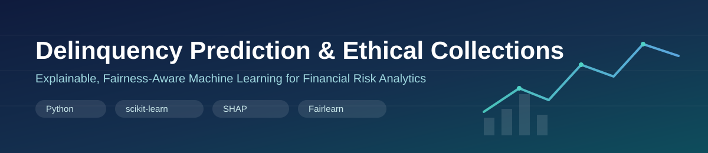

<p align="center">
  
</p>

<h1 align="center">Delinquency Prediction &amp; Risk-Based Collections Automation</h1>
<p align="center">
  <em>Intelligent Delinquency Prediction and Ethical Collections Strategy using Explainable AI</em>
</p>

<p align="center">
  
  
  
  
  
</p>

<p align="center">
  🏆 Built as part of the <strong>Tata Group Data Analytics Job Simulation (Forage, July 2025)</strong> —
  <a href="./images/TataIQ_%40Forage_GenAI_Certificate.pdf">view the completion certificate</a>
</p>

---

## 1. Project Overview

This project simulates the role of a data analyst on the Financial Services team at **Tata iQ**, tasked with building a system to predict customer **delinquency risk** and recommend **ethical, automated collections actions**.

The repository combines three things that are often kept separate in student projects, but matter a great deal in real financial risk work:

- A **supervised machine learning pipeline** that predicts which customers are likely to become delinquent on their accounts.
- An **explainability and fairness lens** on that pipeline, so predictions can be justified to regulators, auditors, and customers — not just accepted at face value.
- A **proposed operational workflow** for turning model scores into responsible, human-in-the-loop collections actions rather than blunt automated penalties.

The end-to-end flow is: **raw data → cleaning & imputation → EDA → feature engineering → model training → evaluation → explainability & fairness review → business recommendations.**

## 2. Business Problem

Lenders and subscription-based financial service providers routinely lose revenue and increase operational cost because they cannot identify at-risk accounts early enough. Three problems recur across the industry and motivate this project:

- **Late detection of risk** — by the time an account is visibly delinquent, recovery options are limited and more expensive.
- **Imbalanced outcomes** — delinquent customers are a small minority of the overall portfolio, so naive models can look accurate while missing almost all of the customers who actually matter.
- **Opaque, potentially unfair decisions** — collections actions driven by a "black box" model risk breaching fair-lending expectations if the model leans on proxies for age, employment status, or location without scrutiny.

## 3. Business Objectives

1. Build a predictive model that flags customers with a high likelihood of becoming delinquent, using historical account, credit, and payment-behavior data.
2. Prioritize **recall on the delinquent class** — in a collections context, missing a genuinely at-risk customer is typically costlier than an unnecessary manual review of a low-risk one.
3. Make the model's decisions **explainable** at both the portfolio level and the individual-customer level.
4. Assess whether the model's predictions are **fair** across sensitive segments (e.g., employment status, age, location) before it is allowed to influence real collections decisions.
5. Translate model outputs into a **staged, auditable collections workflow** — reminders, escalations, and human review — rather than a single automated cutoff.

## 4. Dataset

The project uses `Fully_Cleaned_Delenquency_Prediction_Dataset.xlsx`, a synthetic customer-account dataset with **500 customers** and **19 columns**:

| Category | Columns |
|---|---|
| Identifier | `Customer_ID` |
| Demographics | `Age`, `Income`, `Employment_Status`, `Location` |
| Credit profile | `Credit_Score`, `Credit_Utilization`, `Credit_Card_Type` |
| Loan/account details | `Loan_Balance`, `Debt_to_Income_Ratio`, `Account_Tenure` |
| Behavioral history | `Missed_Payments`, `Month_1` – `Month_6` (monthly payment status: `On-time` / `Late` / `Missed`) |
| **Target** | `Delinquent_Account` (1 = delinquent, 0 = not delinquent) |

**Class balance:** 420 non-delinquent accounts (84%) vs. **80 delinquent accounts (16%)** — a moderately imbalanced classification problem, which is why resampling is part of the pipeline.

**Data quality note surfaced during EDA:** `Employment_Status` contains inconsistent labeling for the same categories (e.g. `EMP`, `Employed`, `employed`) that has not yet been standardized in the pipeline — flagged below under [Future Improvements](#20-future-improvements).

## 5. Project Workflow

```
Raw Excel dataset
      │
      ▼
1. EDA_Databse.py            → inspect schema, dtypes, and missingness
      │
      ▼
2. Imputation.py              → regression-based Income imputation (segmented by Employment_Status)
      │
      ▼
3. RandomForestClassifier_model.py
      ├─ Preprocessing (impute + scale numeric, impute + one-hot encode categorical)
      ├─ Stratified train/test split
      ├─ SMOTE oversampling (training data only)
      ├─ RandomForestClassifier training
      ├─ Evaluation (classification report, ROC/PR curves, feature importance)
      └─ Risk-based flagging → predicted_delinquent_accounts_with_flags.csv
```

## 6. Technology Stack

| Layer | Tools |
|---|---|
| Language | Python 3 |
| Data Processing | Pandas, NumPy |
| Data handling | `pandas`, `numpy`, `openpyxl` |
| Modeling | `scikit-learn` (`RandomForestClassifier`, `Pipeline`, `ColumnTransformer`) |
| Imbalanced data | `imbalanced-learn` (`SMOTE`) |
| Visualization | `matplotlib`, `seaborn` |
| Explainability (proposed) | `SHAP` |
| Fairness (proposed) | `Fairlearn` |
| Data source | Excel (`.xlsx`) |

## 7. Exploratory Data Analysis

`EDA_Databse.py` performs the initial data audit:

- Loads the dataset and inspects structure with `df.info()`.
- Computes missing-value counts per column — **`Income` is the only column with missing values** in the raw file.
- Cross-tabulates missingness in `Income` against `Employment_Status` to check whether missingness is random or tied to a specific segment.
- Confirms how many missing incomes remain specifically among **employed (`EMP`)** customers, since that segment is handled separately in imputation.

This step establishes that a single, well-understood gap (`Income` for employed customers) needs to be resolved before modeling, rather than reaching for a blanket imputation strategy across the whole dataset.

## 8. Feature Engineering

**Missing-value imputation (`Imputation.py`):**
Rather than filling missing `Income` values with a simple mean or median, the project trains a small **linear regression model** to predict income for employed customers who are missing it, using:

- `Age`, `Loan_Balance`, `Credit_Utilization`, `Debt_to_Income_Ratio`, `Account_Tenure`

as predictors. The regression is trained only on employed customers with complete data, then applied to the employed customers with missing income — a more defensible approach than segment-agnostic imputation, since income is expected to correlate with these financial attributes.

**Feature set used for modeling:**
- **Numerical features:** `Age`, `Income`, `Credit_Score`, `Credit_Utilization`, `Missed_Payments`, `Loan_Balance`, `Debt_to_Income_Ratio`, `Account_Tenure`
- **Categorical features:** `Employment_Status`, `Credit_Card_Type`, `Location`, and the six monthly payment-status columns `Month_1`–`Month_6`
- `Customer_ID` is dropped as a non-predictive identifier.

## 9. Machine Learning Pipeline

Implemented in `RandomForestClassifier_model.py` using a `scikit-learn` `Pipeline` / `ColumnTransformer`:

1. **Numeric transformer:** mean imputation → `StandardScaler`.
2. **Categorical transformer:** most-frequent imputation → `OneHotEncoder(handle_unknown='ignore')`.
3. **Train/test split:** 75% / 25%, stratified on `Delinquent_Account` to preserve class balance in both sets.
4. **Class imbalance handling:** `SMOTE` is applied **only to the training set** (after preprocessing), so the model learns from a balanced set of examples without leaking synthetic samples into evaluation data.
5. **Model:** `RandomForestClassifier(n_estimators=200, random_state=42)`.
6. **Risk flagging:** predicted probabilities are compared against a configurable threshold (`flagging_threshold`) to produce a `flagged_as_risk_sensitive` column for the collections team, in addition to the model's default class prediction.

## 10. Model Performance

Evaluation metrics computed from the model's held-out test predictions (`predicted_delinquent_accounts_with_flags.csv`, 125 test accounts, 20 of them truly delinquent):

| Metric | Value |
|---|---|
| Overall accuracy | 0.85 |
| Precision — delinquent class | 1.00 |
| Recall — delinquent class | 0.05 |
| F1-score — delinquent class | 0.10 |
| ROC-AUC | 0.49 |

**Honest read of these numbers:** overall accuracy looks strong, but that is driven almost entirely by the majority (non-delinquent) class — the model currently identifies only a small fraction of true delinquent accounts at its default 0.5 decision threshold, and the ROC-AUC of ~0.49 indicates the model is barely outperforming random guessing on this test split. This directly contradicts a "high accuracy" headline number and is exactly the kind of gap that matters more than accuracy in a collections use case, since **recall on the delinquent class is the metric the business actually cares about** (see [Business Objectives](#4-business-objectives)).

A second artifact in the same CSV, `flagged_as_risk_sensitive`, applies a **lower, recall-oriented threshold (~0.2 rather than 0.5)** and flags 79 of 125 accounts as risk-sensitive — closer to the business intent of casting a wider net for manual review, at the cost of many more false positives. The two columns do not currently correspond to the same run of the script (the code's hard-coded `flagging_threshold = 0.5` does not reproduce the shipped CSV's ~0.2 behavior), which is called out explicitly in [Future Improvements](#20-future-improvements) as a reproducibility gap to close.

## 11. Explainability (SHAP)

The current codebase implements **feature importance from the trained Random Forest** (`model.feature_importances_`, visualized in `feature_importances.png`) as a first-pass, global view of which features drive predictions.

**SHAP-based explainability is part of the project's design and business proposal** (justified during the Forage simulation as the mechanism for producing per-customer, auditable explanations — e.g., "this customer was flagged primarily due to rising credit utilization and two missed payments in the last quarter") but is **not yet implemented in the committed scripts**. Adding `shap.TreeExplainer` on top of the existing pipeline is the natural next step and is listed under [Future Improvements](#20-future-improvements).

## 12. Fairness Assessment

Similarly, a **Fairlearn-based fairness assessment** — checking whether false-negative/false-positive rates differ meaningfully across `Employment_Status`, `Age` bands, or `Location` — was proposed and justified as part of the Forage business strategy deliverable, in line with responsible-AI expectations for lending-adjacent decisions. It is **not yet implemented in code** in this repository. Before any version of this model is used to influence real collections actions, this fairness diagnostic step should be treated as a hard requirement, not an optional add-on.

## 13. Business Impact

Even in its current, first-pass form, the pipeline demonstrates a workflow that a financial services team could build on:

- A **repeatable script** for the full journey from raw Excel data to a scored, exportable list of flagged accounts (`predicted_delinquent_accounts_with_flags.csv`) that a collections team can act on.
- A **configurable risk threshold** that lets the business trade off between "review more accounts" (higher recall, more manual workload) and "review fewer accounts" (higher precision, more risk of missed delinquencies) without retraining the model.
- A structured basis for **leadership reporting**, since the classification report, ROC/PR curves, and feature-importance chart are all generated automatically alongside the flagged-accounts export.
- The current recall gap on the delinquent class (Section 10) is itself a useful business finding: it shows this first iteration is **not yet ready to replace manual review**, and quantifies exactly how much of a gap remains before it could.

## 14. Proposed Production Workflow

Building on the Forage simulation's collections-strategy deliverable, a production version of this system would move from a single batch script to a staged, human-in-the-loop workflow:

1. **Score** the active customer portfolio on a scheduled cadence (e.g., nightly or weekly) using the trained pipeline.
2. **Tier customers by risk** using calibrated probability bands rather than a single cutoff (e.g., low / medium / high risk).
3. **Route by tier**: low-risk accounts receive automated, low-touch reminders; medium-risk accounts trigger an outreach workflow; high-risk accounts are escalated to a human collections agent with a SHAP-based explanation attached.
4. **Gate high-impact actions behind human review** — no fully automated account-level penalty (fees, credit reporting, etc.) should fire without a human sign-off threshold.
5. **Run the Fairlearn fairness check** on every scoring cycle, not just at model-build time, and alert if disparity metrics drift.
6. **Log every decision** (score, threshold, action taken, human override if any) to support audits and a future self-learning feedback loop.

## 15. Repository Structure

```
Delinquency_Prediction_Python_GenAIProjrct-main/
├── EDA_Databse.py                                   # Step 1: data audit & missingness analysis
├── Imputation.py                                    # Step 2: regression-based Income imputation
├── RandomForestClassifier_model.py                  # Step 3: preprocessing, SMOTE, training, evaluation, export
├── Fully_Cleaned_Delenquency_Prediction_Dataset.xlsx # Source dataset (500 customers, 19 columns)
├── predicted_delinquent_accounts_with_flags.csv      # Model output: scored + flagged test accounts
├── TataIQ_@Forage_GenAI_Certificate.pdf              # Forage job-simulation completion certificate
└── README.md
```

> **Note:** the scripts currently reference local Windows file paths (e.g. `C:\Users\prave\...`). Update these to relative paths before running on another machine — see [Installation](#18-installation).

## 16. Installation

```bash
# 1. Clone the repository
git clone https://github.com/Sivaan66/Delinquency_Prediction_Python_GenAIProjrct.git
cd Delinquency_Prediction_Python_GenAIProjrct-main

# 2. Create and activate a virtual environment (recommended)
python -m venv venv
source venv/bin/activate        # on Windows: venv\Scripts\activate

# 3. Install dependencies
pip install pandas numpy scikit-learn imbalanced-learn matplotlib seaborn openpyxl shap fairlearn
```

Before running the scripts, update the hard-coded file paths in `EDA_Databse.py`, `Imputation.py`, and `RandomForestClassifier_model.py` to point to your local copy of `Fully_Cleaned_Delenquency_Prediction_Dataset.xlsx` (or refactor them to accept a path argument).

## 17. Usage

Run the pipeline in order:

```bash
# Step 1: explore the raw data and confirm missingness
python EDA_Databse.py

# Step 2: impute missing Income values for employed customers
python Imputation.py

# Step 3: train the model, evaluate it, and export flagged accounts
python RandomForestClassifier_model.py
```

Running `RandomForestClassifier_model.py` will:

- Print dataset diagnostics, class distribution, and the classification report / confusion matrix / ROC-AUC / PR-AUC to the console.
- Save `precision_recall_curve.png`, `roc_curve.png`, and `feature_importances.png` to the working directory.
- Save the scored test set with flags to `predicted_delinquent_accounts_with_flags.csv`.

## 18. Future Improvements

- **Close the reproducibility gap** between the committed `predicted_delinquent_accounts_with_flags.csv` and the current script's hard-coded 0.5 threshold (Section 10), and re-generate the export from the exact current pipeline.
- **Improve recall on the delinquent class** — investigate whether SMOTE parameters, class weighting, alternative models (e.g. gradient boosting), or richer features from `Month_1`–`Month_6` payment history can lift recall well above the current 0.05 without destroying precision.
- **Implement SHAP explainability** (Section 11) on top of the trained pipeline for per-customer, auditable explanations.
- **Implement the Fairlearn fairness assessment** (Section 12) across `Employment_Status`, `Age`, and `Location`.
- **Standardize categorical labels** — `Employment_Status` currently contains inconsistent casing/variants of the same category (e.g. `EMP`, `Employed`, `employed`) that should be normalized before encoding.
- **Replace hard-coded local file paths** with relative paths or CLI arguments so the scripts run out of the box on any machine.
- **Move from a single train/test split to cross-validation** for a more robust estimate of model performance given the small dataset (500 rows).
- **Calibrate predicted probabilities** (e.g. Platt scaling or isotonic regression) before using them for risk tiering, since raw Random Forest probabilities are not automatically well-calibrated.

## 19. Author

**Sivaan**
Final-year B.Tech Electrical Engineering student transitioning into data analytics and AI/ML.
GitHub: [github.com/Sivaan66](https://github.com/Sivaan66)

Project completed as part of the **Tata Group Data Analytics Job Simulation on Forage (July 2025)** — [certificate included in this repo](./TataIQ_%40Forage_GenAI_Certificate.pdf).

---

<p align="center"><sub>This project uses a synthetic dataset for educational and portfolio purposes and does not represent real customer data.</sub></p>
